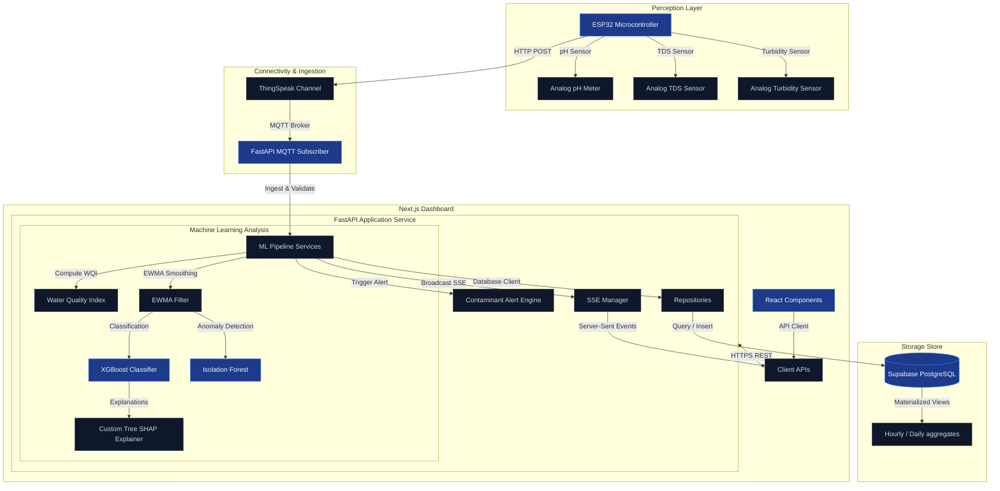

# AquaSense — IoT Water Quality Monitoring & ML Diagnostics

[](https://opensource.org/licenses/MIT)

AquaSense is an open-source, end-to-end IoT platform for real-time water quality tracking, statistical anomaly detection, and predictive safety analysis. It integrates ESP32 microcontrollers, ThingSpeak MQTT brokers, a FastAPI backend orchestrating a 3-layer machine learning pipeline, and a Next.js dashboard streaming live metrics over Server-Sent Events (SSE).

---

## 🏗 System Architecture

AquaSense uses a decoulped architecture that bridges hardware telemetry, machine learning intelligence, and a real-time reactive UI.



---

## 🛠 Tech Stack

*   **Firmware:** C++/Arduino for ESP32 with `WiFi.h` and `ThingSpeak.h` integration.
*   **Backend:** FastAPI, `aiomqtt` (WebSocket MQTT client for ThingSpeak), `pydantic-settings` (v2), and `structlog` (structured logging).
*   **Machine Learning:** XGBoost (v3.0), Scikit-learn (Isolation Forest), Pandas, NumPy, and Joblib.
*   **Frontend:** Next.js (App Router), Tailwind CSS (v4), React (v19), Recharts.
*   **Database:** Supabase PostgreSQL with time-series aggregates (Hourly/Daily materialized views).

---

## 🔌 Hardware Requirements

To build the perception layer, you need the following hardware components:
1.  **ESP32 Microcontroller** (NodeMCU-32S or similar NodeMCU dev module).
2.  **Analog pH Sensor** (with calibration board, e.g., DFRobot SEN0161).
3.  **Analog TDS Sensor** (e.g., DFRobot SEN0244).
4.  **Analog Turbidity Sensor** (e.g., DFRobot SEN0189).
5.  **Voltage Divider Resistors** for Turbidity Sensor (10kΩ and 20kΩ) to scale the 5V sensor output to the safe 3.3V ESP32 ADC range.

---

## ⚙️ Setup Instructions

### 1. Firmware Flash Setup
1.  Open `firmware/AquaSense/AquaSense.ino` in the Arduino IDE.
2.  Install required libraries via the Library Manager:
    *   `ThingSpeak` by MathWorks.
3.  Ensure your ESP32 board support packages are installed.
4.  Update the configuration section in `AquaSense.ino` with your local Wi-Fi SSID, Password, and your ThingSpeak channel write API key:
    ```cpp
    const char* ssid = "YOUR_WIFI_SSID";
    const char* password = "YOUR_WIFI_PASSWORD";
    unsigned long channelID = YOUR_THINGSPEAK_CHANNEL_ID;
    const char * writeAPIKey = "YOUR_THINGSPEAK_WRITE_API_KEY";
    ```
5.  Connect your ESP32 via USB, select your board and COM port, and click **Upload**.

### 2. Backend Setup
1.  Navigate to the backend directory:
    ```bash
    cd backend
    ```
2.  Create and activate a virtual environment:
    ```bash
    python -m venv .venv
    # Windows:
    .venv\Scripts\activate
    # macOS/Linux:
    source .venv/bin/activate
    ```
3.  Install dependencies:
    ```bash
    pip install -r requirements.txt
    ```
4.  Set up your environment parameters:
    ```bash
    cp .env.example .env
    ```
    Open `.env` and fill in your Supabase database configurations and ThingSpeak credentials.
5.  Run database migrations sequentially in your Supabase SQL editor:
    *   Relational schemas in `backend/migrations/relational/`
    *   Time-series aggregates in `backend/migrations/timescaledb/`
6.  Start the local development server:
    ```bash
    uvicorn app.main:app --reload
    ```
7.  Verify tests pass:
    ```bash
    pytest
    ```

### 3. Frontend Setup
1.  Navigate to the frontend directory:
    ```bash
    cd frontend
    ```
2.  Install dependencies:
    ```bash
    npm install
    ```
3.  Set up environment parameters:
    ```bash
    cp .env.example .env.local
    ```
    Configure the parameters (e.g., pointing `NEXT_PUBLIC_API_URL` to your local backend).
4.  Run the development server:
    ```bash
    npm run dev
    ```
5.  Open [http://localhost:3000](http://localhost:3000) in your browser.

---

## 🔑 Environment Variables

### Backend (`backend/.env`)
*   `SUPABASE_URL`: Your Supabase project URL.
*   `SUPABASE_KEY`: Your Supabase anonymous/public key.
*   `SUPABASE_SERVICE_ROLE_KEY`: Supabase server-only administration key (bypasses RLS).
*   `SUPABASE_JWT_SECRET`: Secret token used to verify authentication JWT signatures.
*   `THINGSPEAK_MQTT_USER`: ThingSpeak MQTT broker username.
*   `THINGSPEAK_MQTT_API_KEY`: ThingSpeak MQTT broker API key.
*   `THINGSPEAK_MQTT_CLIENT_ID`: ThingSpeak MQTT client ID (falls back to username if empty).
*   `THINGSPEAK_REST_API_KEY`: Optional fallback ThingSpeak REST API read key for catch-up syncing.
*   `FRONTEND_URL`: URL of the web dashboard (e.g., `http://localhost:3000`).
*   `ENVIRONMENT`: `development`, `staging`, or `production`.

### Frontend (`frontend/.env.local`)
*   `NEXT_PUBLIC_SUPABASE_URL`: Your Supabase project URL.
*   `NEXT_PUBLIC_SUPABASE_ANON_KEY`: Your Supabase anonymous/public key.
*   `NEXT_PUBLIC_API_URL`: Root endpoint of the backend API (e.g., `http://localhost:8000`).

---

## 📄 License & Attribution

This project is licensed under the MIT License - see the [LICENSE](file:///LICENSE) file for details.

Developed and maintained by the **Project Maintainers**.