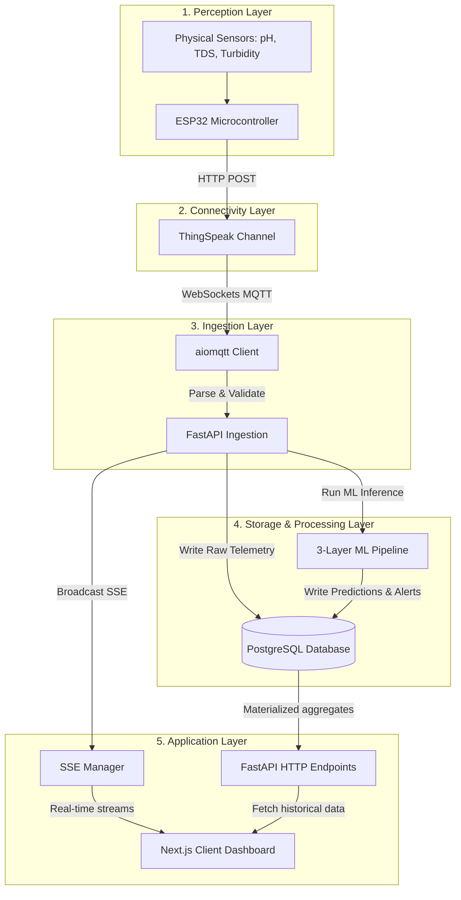
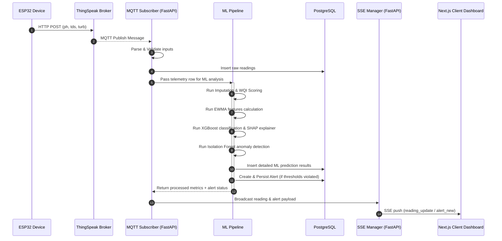
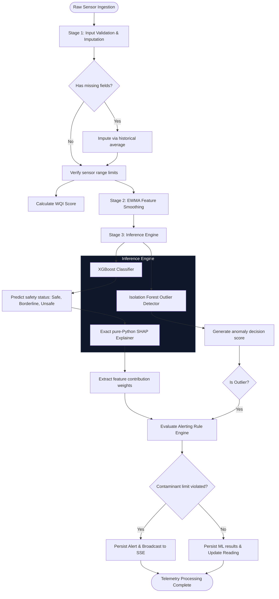

# AquaSense System Architecture

This document describes the architectural design, system layers, data flows, and technical decisions of the AquaSense IoT Water Quality Monitoring platform.

---

## 1. 5-Layer IoT Architecture

AquaSense is structured around a standard 5-layer IoT model to decouple concerns and ensure scalability from sensor nodes up to the web dashboard.

### 1.1 Ingestion Layer Design (MQTT WebSocket Subscriber)
Telemetry values read by the ESP32 firmware are posted to ThingSpeak via HTTP POST. Rather than long-polling ThingSpeak's REST API from the application backend (which introduces polling overhead and latency), the FastAPI backend maintains a persistent WebSocket connection to the ThingSpeak MQTT Broker (`mqtt3.thingspeak.com`).
*   **Latency:** Propagation latency drops from ~60 seconds to ~1–3 seconds.
*   **Connection Resilience:** The backend uses an always-on hosting context that keeps the TCP/WebSocket subscriber loop active. Reconnection mechanisms with exponential backoff and REST API catch-up queries are implemented to handle transient network drops.

### 1.2 Storage Layer Design (TimescaleDB / Partitioned Relational fallback)
Sensor readings are partitioned and indexed chronologically. To improve query performance for charts (24h/7d/30d views), the database pre-computes hourly and daily metrics using PostgreSQL Materialized Views.
*   **Query Performance:** Chronological queries read directly from views instead of scanning raw telemetry rows.
*   **pg_cron Aggregation:** Views are concurrently refreshed on a set schedule (`pg_cron`) in production.

---

## 2. Ingestion Sequence

The diagram below traces telemetry from the physical hardware through ingestion, storage, ML pipeline evaluation, and live Server-Sent Events (SSE) broadcast to browser clients.

---

## 3. Machine Learning Processing Pipeline

Every incoming reading undergoes three processing stages:

1.  **Validation & Imputation:** Checks incoming fields against physical bounds (e.g., pH between 0 and 14). Missing or out-of-bounds metrics are filled using a historical running average.
2.  **Smoothing & WQI Calculation:** Computes a Water Quality Index (WQI) score and applies Exponentially Weighted Moving Average (EWMA) smoothing to reduce noise and sensor drift.
3.  **Inference:**
    *   **XGBoost Classifier:** Predicts the safety status (`Safe`, `Borderline`, `Unsafe`).
    *   **SHAP Explainer:** A custom, pure-Python tree explainer computes mathematically exact feature contributions to explain why a status was predicted.
    *   **Isolation Forest:** Detects multidimensional anomalies to flag potential sensor failure or sudden contamination.
