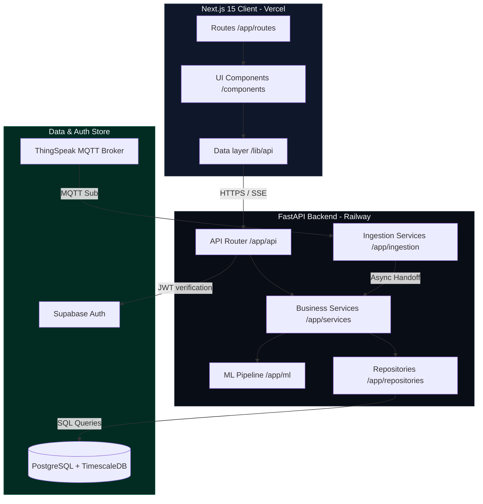
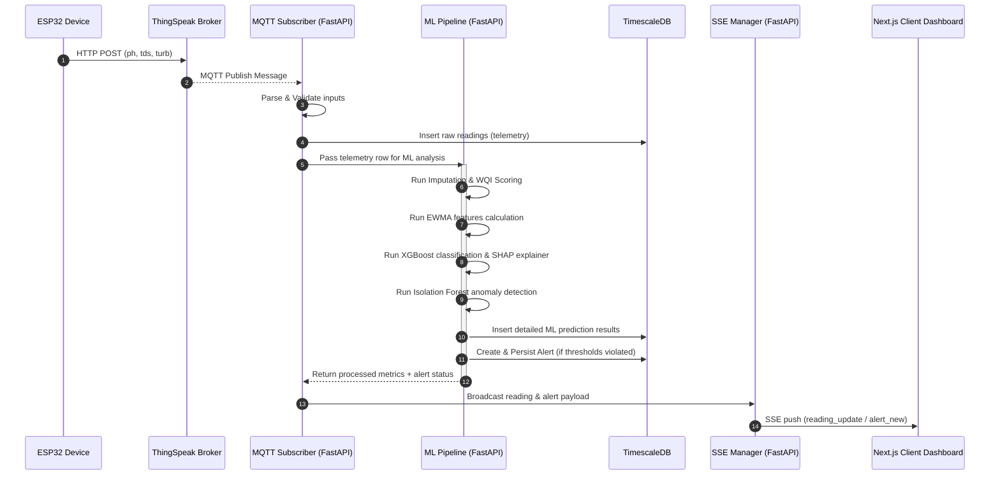
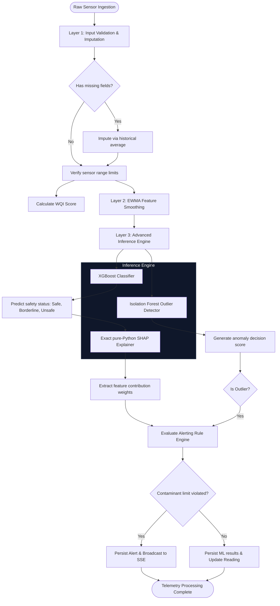

# AquaSense System Architecture & Diagrams

This document contains Mermaid diagrams visualizing the architecture, data ingestion pipelines, and ML processing flows for the AquaSense platform.

---

## 1. System Overview & Layered Architecture

AquaSense follows a strict layered architecture pattern as governed by the project constitution. No layer may cross over its immediate neighbors.

---

## 2. Real-Time Telemetry Ingestion Flow

Telemetry flows from the ESP32 to ThingSpeak, which propagates it via MQTT. The backend processes the message in real time and broadcasts it to client browsers over Server-Sent Events (SSE).

---

## 3. Machine Learning Diagnosis Pipeline

AquaSense runs a structured 3-layer machine learning diagnostic pipeline on every incoming sensor reading.

